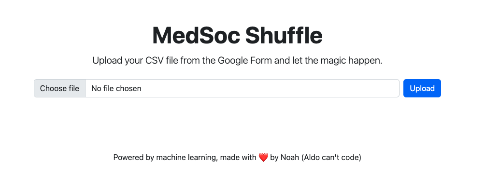

# MedSocShuffle

Uses a simple algorithm to first assign leaders, and then shuffle people into their preferenced groups

## Components

### VueJS App

Simple VueJS app that allows MedSoc officials to upload the CSV from the Google Form link, makes calls to the Flask backend.

### Flask Backend

Uses the shuffle library to provide one simple endpoint that allows the frontend VueJS app to grab the assignments.

### Python Library

The heavy-lifting component that takes an uncleaned and uncomprehensable CSV file from Google Sheets and does some data cleaning and organisation, after which it's passed to the shuffling model (not very opinionated).

Also has some considerations for people missing from ordering in order to inform MedSoc officials of the possible need for manual intervention.
